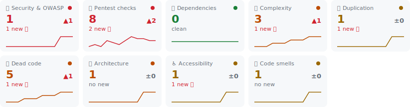

<!-- pr-review-insight -->

## ❌ Code review gate failed `blocks merge`

_policy: zero new critical · max 5 new major · max duplication 5% (new) · PR #12_

> [!CAUTION]
> **2 new critical findings block this merge** — worst: `pentest/public-env-secret` in `.env` (A07:2021-Identification and Authentication Failures).

**Gate violations**

- ❌ 2 new critical finding(s) — limit 0

<picture>
  <source media="(prefers-color-scheme: dark)" srcset="./overview-band-dark.svg">
  
</picture>

Findings per category for this PR · Δ vs base `a1b2c3d` · sparklines: last 12 baseline runs

<b>🆕 Introduced by this PR (7) — what the gate judges</b>

| Where                                                                                             | Rule                                   | Severity           | Finding                                                                                                        |
| ------------------------------------------------------------------------------------------------- | -------------------------------------- | ------------------ | -------------------------------------------------------------------------------------------------------------- |
| [`.env:4`](https://github.com/acme/webapp/blob/feedbeef0012/.env#L4-L4)                           | `pentest/public-env-secret`            | **🟥 critical** 🆕 | **Secret-looking key under a client-exposed env prefix — it ships in the bundle**                              |
| [`src/danger.ts:3`](https://github.com/acme/webapp/blob/feedbeef0012/src/danger.ts#L3-L3)         | `security/detect-eval-with-expression` | **🟥 critical** 🆕 | **eval with argument of type Identifier**                                                                      |
| [`src/index.ts:16`](https://github.com/acme/webapp/blob/feedbeef0012/src/index.ts#L16-L16)        | `sonarjs/cognitive-complexity`         | **🟧 major** 🆕    | **Refactor this function to reduce its Cognitive Complexity from 43 to the 15 allowed.**                       |
| [`package.json`](https://github.com/acme/webapp/blob/feedbeef0012/package.json)                   | `knip/unused-dependency`               | **🟨 minor** 🆕    | **Unused dependency `left-pad`**                                                                               |
| [`src/Component.tsx:4`](https://github.com/acme/webapp/blob/feedbeef0012/src/Component.tsx#L4-L4) | `jsx-a11y/alt-text`                    | **🟨 minor** 🆕    | **img elements must have an alt prop, either with meaningful text, or an empty string for decorative images.** |
| [`src/danger.ts:5`](https://github.com/acme/webapp/blob/feedbeef0012/src/danger.ts#L5-L5)         | `pentest/cleartext-http`               | **🟨 minor** 🆕    | **Cleartext `http://` URL — use https**                                                                        |
| [`src/invoices.ts:3–22`](https://github.com/acme/webapp/blob/feedbeef0012/src/invoices.ts#L3-L22) | `jscpd/duplication`                    | **🟨 minor** 🆕    | **20 duplicated lines, also at src/orders.ts:3–22**                                                            |

🔐 Security & OWASP (1 new · 1 total)

**A03:2021-Injection**

| Where                                                                                     | Rule                                   | Severity           | Finding                                   |
| ----------------------------------------------------------------------------------------- | -------------------------------------- | ------------------ | ----------------------------------------- |
| [`src/danger.ts:3`](https://github.com/acme/webapp/blob/feedbeef0012/src/danger.ts#L3-L3) | `security/detect-eval-with-expression` | **🟥 critical** 🆕 | **eval with argument of type Identifier** |

🎯 Pentest checks (2 new · 8 total)

| Where                                                                                             | Rule                                 | Severity           | Finding                                                                           |
| ------------------------------------------------------------------------------------------------- | ------------------------------------ | ------------------ | --------------------------------------------------------------------------------- |
| [`.env:4`](https://github.com/acme/webapp/blob/feedbeef0012/.env#L4-L4)                           | `pentest/public-env-secret`          | **🟥 critical** 🆕 | **Secret-looking key under a client-exposed env prefix — it ships in the bundle** |
| [`src/danger.ts:5`](https://github.com/acme/webapp/blob/feedbeef0012/src/danger.ts#L5-L5)         | `pentest/cleartext-http`             | **🟨 minor** 🆕    | **Cleartext `http://` URL — use https**                                           |
| [`src/Component.tsx:5`](https://github.com/acme/webapp/blob/feedbeef0012/src/Component.tsx#L5-L5) | `pentest/dangerously-set-inner-html` | 🟧 major           | `dangerouslySetInnerHTML` — XSS sink, sanitize or remove                          |
| [`src/danger.ts:4`](https://github.com/acme/webapp/blob/feedbeef0012/src/danger.ts#L4-L4)         | `pentest/new-function`               | 🟧 major           | `new Function()` — dynamic code execution                                         |
| [`src/danger.ts:10`](https://github.com/acme/webapp/blob/feedbeef0012/src/danger.ts#L10-L10)      | `pentest/open-redirect`              | 🟧 major           | Possible open redirect from user-controlled input                                 |
| [`index.html:8`](https://github.com/acme/webapp/blob/feedbeef0012/index.html#L8-L8)               | `pentest/target-blank-no-rel`        | 🟨 minor           | `target="_blank"` without `rel="noopener"` — reverse tabnabbing                   |
| [`src/Component.tsx:6`](https://github.com/acme/webapp/blob/feedbeef0012/src/Component.tsx#L6-L6) | `pentest/target-blank-no-rel`        | 🟨 minor           | `target="_blank"` without `rel="noopener"` — reverse tabnabbing                   |
| [`index.html`](https://github.com/acme/webapp/blob/feedbeef0012/index.html)                       | `pentest/missing-csp`                | ⬜ info            | No Content-Security-Policy meta tag — consider adding one (or set the header)     |

🌀 Complexity (1 new · 3 total)

| Where                                                                                         | Rule                           | Severity        | Finding                                                                                  |
| --------------------------------------------------------------------------------------------- | ------------------------------ | --------------- | ---------------------------------------------------------------------------------------- |
| [`src/index.ts:16`](https://github.com/acme/webapp/blob/feedbeef0012/src/index.ts#L16-L16)    | `sonarjs/cognitive-complexity` | **🟧 major** 🆕 | **Refactor this function to reduce its Cognitive Complexity from 43 to the 15 allowed.** |
| [`src/index.ts:23–31`](https://github.com/acme/webapp/blob/feedbeef0012/src/index.ts#L23-L31) | `max-depth`                    | 🟧 major        | Blocks are nested too deeply (6). Maximum allowed is 5.                                  |
| [`src/index.ts:24–30`](https://github.com/acme/webapp/blob/feedbeef0012/src/index.ts#L24-L30) | `max-depth`                    | 🟧 major        | Blocks are nested too deeply (7). Maximum allowed is 5.                                  |

👯 Duplication (1 new · 1 total · 12.7% duplicated)

| Clone                                                                                             | Also at                                                                                       | Severity        |
| ------------------------------------------------------------------------------------------------- | --------------------------------------------------------------------------------------------- | --------------- |
| [`src/invoices.ts:3–22`](https://github.com/acme/webapp/blob/feedbeef0012/src/invoices.ts#L3-L22) | [`src/orders.ts:3–22`](https://github.com/acme/webapp/blob/feedbeef0012/src/orders.ts#L3-L22) | **🟨 minor** 🆕 |

🪦 Dead code (1 new · 5 total)

| File                                                                                      | Symbol        | Why                                 |
| ----------------------------------------------------------------------------------------- | ------------- | ----------------------------------- |
| [`package.json`](https://github.com/acme/webapp/blob/feedbeef0012/package.json)           | `left-pad`    | **Unused dependency `left-pad`** 🆕 |
| [`src/Component.tsx`](https://github.com/acme/webapp/blob/feedbeef0012/src/Component.tsx) | `entire file` | File is never imported              |
| [`src/unused.ts`](https://github.com/acme/webapp/blob/feedbeef0012/src/unused.ts)         | `entire file` | File is never imported              |
| [`src/danger.ts:9`](https://github.com/acme/webapp/blob/feedbeef0012/src/danger.ts#L9-L9) | `redirect`    | Unused export `redirect`            |
| [`src/util.ts:5`](https://github.com/acme/webapp/blob/feedbeef0012/src/util.ts#L5-L5)     | `neverCalled` | Unused export `neverCalled`         |

♿ Accessibility (1 new · 1 total)

| Where                                                                                             | Rule                | Severity        | Finding                                                                                                        |
| ------------------------------------------------------------------------------------------------- | ------------------- | --------------- | -------------------------------------------------------------------------------------------------------------- |
| [`src/Component.tsx:4`](https://github.com/acme/webapp/blob/feedbeef0012/src/Component.tsx#L4-L4) | `jsx-a11y/alt-text` | **🟨 minor** 🆕 | **img elements must have an alt prop, either with meaningful text, or an empty string for decorative images.** |

🔄 Architecture (1 total)

| Where                                                                   | Rule                        | Severity | Finding                                             |
| ----------------------------------------------------------------------- | --------------------------- | -------- | --------------------------------------------------- |
| [`src/a.ts`](https://github.com/acme/webapp/blob/feedbeef0012/src/a.ts) | `madge/circular-dependency` | 🟧 major | Circular dependency: src/a.ts → src/b.ts → src/a.ts |

🧹 Code smells (1 total)

| Where                                                                                     | Rule                | Severity | Finding                                                             |
| ----------------------------------------------------------------------------------------- | ------------------- | -------- | ------------------------------------------------------------------- |
| [`src/danger.ts:3`](https://github.com/acme/webapp/blob/feedbeef0012/src/danger.ts#L3-L3) | `sonarjs/code-eval` | 🟨 minor | Make sure that this dynamic injection or execution of code is safe. |

📋 All findings by file (10 files)

**[`.env`](https://github.com/acme/webapp/blob/feedbeef0012/.env)** — 1 finding (**1 new**)

| Where                                                                   | Rule                        | Severity           | Finding                                                                           |
| ----------------------------------------------------------------------- | --------------------------- | ------------------ | --------------------------------------------------------------------------------- |
| [`.env:4`](https://github.com/acme/webapp/blob/feedbeef0012/.env#L4-L4) | `pentest/public-env-secret` | **🟥 critical** 🆕 | **Secret-looking key under a client-exposed env prefix — it ships in the bundle** |

**[`index.html`](https://github.com/acme/webapp/blob/feedbeef0012/index.html)** — 2 findings

| Where                                                                               | Rule                          | Severity | Finding                                                                       |
| ----------------------------------------------------------------------------------- | ----------------------------- | -------- | ----------------------------------------------------------------------------- |
| [`index.html:8`](https://github.com/acme/webapp/blob/feedbeef0012/index.html#L8-L8) | `pentest/target-blank-no-rel` | 🟨 minor | `target="_blank"` without `rel="noopener"` — reverse tabnabbing               |
| [`index.html`](https://github.com/acme/webapp/blob/feedbeef0012/index.html)         | `pentest/missing-csp`         | ⬜ info  | No Content-Security-Policy meta tag — consider adding one (or set the header) |

**[`package.json`](https://github.com/acme/webapp/blob/feedbeef0012/package.json)** — 1 finding (**1 new**)

| Where                                                                           | Rule                     | Severity        | Finding                          |
| ------------------------------------------------------------------------------- | ------------------------ | --------------- | -------------------------------- |
| [`package.json`](https://github.com/acme/webapp/blob/feedbeef0012/package.json) | `knip/unused-dependency` | **🟨 minor** 🆕 | **Unused dependency `left-pad`** |

**[`src/a.ts`](https://github.com/acme/webapp/blob/feedbeef0012/src/a.ts)** — 1 finding

| Where                                                                   | Rule                        | Severity | Finding                                             |
| ----------------------------------------------------------------------- | --------------------------- | -------- | --------------------------------------------------- |
| [`src/a.ts`](https://github.com/acme/webapp/blob/feedbeef0012/src/a.ts) | `madge/circular-dependency` | 🟧 major | Circular dependency: src/a.ts → src/b.ts → src/a.ts |

**[`src/Component.tsx`](https://github.com/acme/webapp/blob/feedbeef0012/src/Component.tsx)** — 4 findings (**1 new**)

| Where                                                                                             | Rule                                 | Severity        | Finding                                                                                                        |
| ------------------------------------------------------------------------------------------------- | ------------------------------------ | --------------- | -------------------------------------------------------------------------------------------------------------- |
| [`src/Component.tsx:4`](https://github.com/acme/webapp/blob/feedbeef0012/src/Component.tsx#L4-L4) | `jsx-a11y/alt-text`                  | **🟨 minor** 🆕 | **img elements must have an alt prop, either with meaningful text, or an empty string for decorative images.** |
| [`src/Component.tsx`](https://github.com/acme/webapp/blob/feedbeef0012/src/Component.tsx)         | `knip/unused-file`                   | 🟧 major        | File is never imported                                                                                         |
| [`src/Component.tsx:5`](https://github.com/acme/webapp/blob/feedbeef0012/src/Component.tsx#L5-L5) | `pentest/dangerously-set-inner-html` | 🟧 major        | `dangerouslySetInnerHTML` — XSS sink, sanitize or remove                                                       |
| [`src/Component.tsx:6`](https://github.com/acme/webapp/blob/feedbeef0012/src/Component.tsx#L6-L6) | `pentest/target-blank-no-rel`        | 🟨 minor        | `target="_blank"` without `rel="noopener"` — reverse tabnabbing                                                |

**[`src/danger.ts`](https://github.com/acme/webapp/blob/feedbeef0012/src/danger.ts)** — 6 findings (**2 new**)

| Where                                                                                        | Rule                                   | Severity           | Finding                                                             |
| -------------------------------------------------------------------------------------------- | -------------------------------------- | ------------------ | ------------------------------------------------------------------- |
| [`src/danger.ts:3`](https://github.com/acme/webapp/blob/feedbeef0012/src/danger.ts#L3-L3)    | `security/detect-eval-with-expression` | **🟥 critical** 🆕 | **eval with argument of type Identifier**                           |
| [`src/danger.ts:5`](https://github.com/acme/webapp/blob/feedbeef0012/src/danger.ts#L5-L5)    | `pentest/cleartext-http`               | **🟨 minor** 🆕    | **Cleartext `http://` URL — use https**                             |
| [`src/danger.ts:4`](https://github.com/acme/webapp/blob/feedbeef0012/src/danger.ts#L4-L4)    | `pentest/new-function`                 | 🟧 major           | `new Function()` — dynamic code execution                           |
| [`src/danger.ts:10`](https://github.com/acme/webapp/blob/feedbeef0012/src/danger.ts#L10-L10) | `pentest/open-redirect`                | 🟧 major           | Possible open redirect from user-controlled input                   |
| [`src/danger.ts:3`](https://github.com/acme/webapp/blob/feedbeef0012/src/danger.ts#L3-L3)    | `sonarjs/code-eval`                    | 🟨 minor           | Make sure that this dynamic injection or execution of code is safe. |
| [`src/danger.ts:9`](https://github.com/acme/webapp/blob/feedbeef0012/src/danger.ts#L9-L9)    | `knip/unused-export`                   | 🟨 minor           | Unused export `redirect`                                            |

**[`src/index.ts`](https://github.com/acme/webapp/blob/feedbeef0012/src/index.ts)** — 3 findings (**1 new**)

| Where                                                                                         | Rule                           | Severity        | Finding                                                                                  |
| --------------------------------------------------------------------------------------------- | ------------------------------ | --------------- | ---------------------------------------------------------------------------------------- |
| [`src/index.ts:16`](https://github.com/acme/webapp/blob/feedbeef0012/src/index.ts#L16-L16)    | `sonarjs/cognitive-complexity` | **🟧 major** 🆕 | **Refactor this function to reduce its Cognitive Complexity from 43 to the 15 allowed.** |
| [`src/index.ts:23–31`](https://github.com/acme/webapp/blob/feedbeef0012/src/index.ts#L23-L31) | `max-depth`                    | 🟧 major        | Blocks are nested too deeply (6). Maximum allowed is 5.                                  |
| [`src/index.ts:24–30`](https://github.com/acme/webapp/blob/feedbeef0012/src/index.ts#L24-L30) | `max-depth`                    | 🟧 major        | Blocks are nested too deeply (7). Maximum allowed is 5.                                  |

**[`src/invoices.ts`](https://github.com/acme/webapp/blob/feedbeef0012/src/invoices.ts)** — 1 finding (**1 new**)

| Where                                                                                             | Rule                | Severity        | Finding                                             |
| ------------------------------------------------------------------------------------------------- | ------------------- | --------------- | --------------------------------------------------- |
| [`src/invoices.ts:3–22`](https://github.com/acme/webapp/blob/feedbeef0012/src/invoices.ts#L3-L22) | `jscpd/duplication` | **🟨 minor** 🆕 | **20 duplicated lines, also at src/orders.ts:3–22** |

**[`src/unused.ts`](https://github.com/acme/webapp/blob/feedbeef0012/src/unused.ts)** — 1 finding

| Where                                                                             | Rule               | Severity | Finding                |
| --------------------------------------------------------------------------------- | ------------------ | -------- | ---------------------- |
| [`src/unused.ts`](https://github.com/acme/webapp/blob/feedbeef0012/src/unused.ts) | `knip/unused-file` | 🟧 major | File is never imported |

**[`src/util.ts`](https://github.com/acme/webapp/blob/feedbeef0012/src/util.ts)** — 1 finding

| Where                                                                                 | Rule                 | Severity | Finding                     |
| ------------------------------------------------------------------------------------- | -------------------- | -------- | --------------------------- |
| [`src/util.ts:5`](https://github.com/acme/webapp/blob/feedbeef0012/src/util.ts#L5-L5) | `knip/unused-export` | 🟨 minor | Unused export `neverCalled` |

Reported by **PR Review Insight** · schema v1 · baseline `a1b2c3d`
